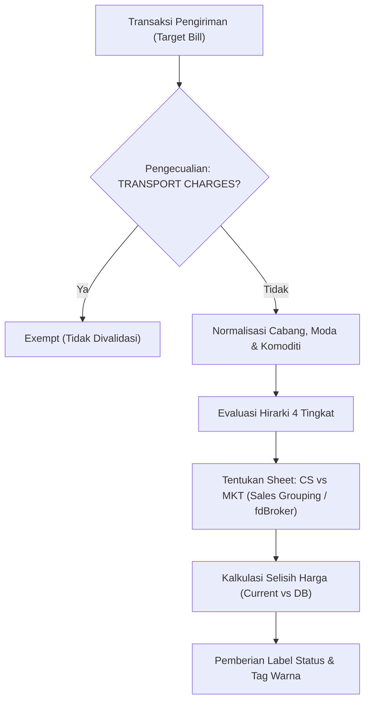
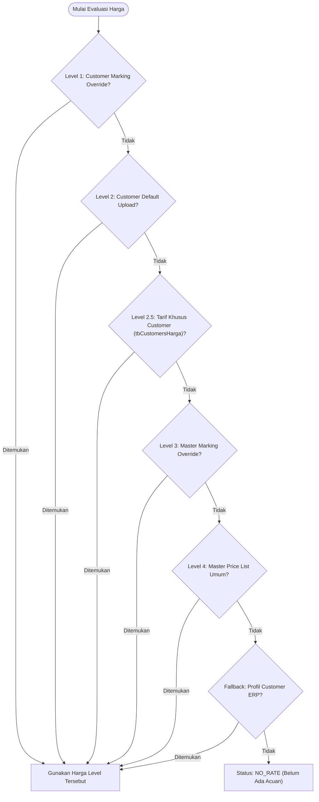

# Logika High-Level Modul Validasi Billing (Price Check Engine)

Dokumen ini menjelaskan arsitektur, alur keputusan (*decision flow*), hirarki penentuan tarif, dan aturan bisnis (*business rules*) yang diterapkan pada modul **Validasi Billing & Pengecekan Kesesuaian Harga** di sistem ERP Shipping.

---

## 1. Tujuan & Ruang Lingkup

Modul Validasi Billing bertugas untuk mengaudit dan memvalidasi kesesuaian harga jual / tarif tagihan (*current price*) yang diinput pada data pengiriman (*Target Bill* / `tbEntryList`) terhadap acuan tarif resmi yang tersimpan di sistem.

Modul ini beroperasi dalam 2 mode:
1. **Batch Price Check (Massal)**: Mengevaluasi seluruh transaksi pada tabel pemantauan *Target Bill* secara asinkron dan cepat (< 100 ms via cache).
2. **Single / Detail Price Check (Modal Interaktif)**: Menyajikan rincian lengkap hirarki perbandingan, daftar tarif khusus customer, acuan master price list, dan histori update tarif saat staf operasional mengklik harga tagihan.

---

## 2. Hirarki 4 Tingkat Penentuan Tarif (*Pricing Hierarchy*)

Sistem mencari acuan harga dengan prioritas bertingkat dari yang paling spesifik (*custom*) hingga ke acuan umum (*global*):

### Penjelasan Setiap Tingkat:

1. **Level 1: Customer Marking Override**
   * Berlaku jika customer memiliki file price list khusus yang mengikat marking tertentu ke atas (misal: Customer `SS/EM` dengan nomor marking $\ge$ `26GZC91`).
2. **Level 2: Customer Default Upload (`TbCustomerPriceListUpload`)**
   * Berlaku jika customer memiliki upload price list khusus yang disepakati secara kontrak, berlaku untuk seluruh pengiriman customer tersebut sesuai periode tanggal efektif.
3. **Level 2.5: Tarif Khusus Customer ERP (`tbCustomersHarga` / `vwCustomersHarga` / `tbCustomersHargaAudit`)**
   * Tarif khusus yang diinput langsung oleh staf sales/operasional di ERP untuk customer tertentu.
   * **Prioritas Log Perubahan (`tbCustomersHargaAudit`)**:
     * Jika terdapat log audit perubahan harga di tabel `tbCustomersHargaAudit` untuk kolom terkait, sistem menggunakan **harga terbaru (`fdNewValue`)**, tanggal update (`fdUpdateDate`), dan user pengubah (`fdUpdatedBy`) dari entri audit terbaru.
     * Jika tidak ada log audit, sistem menggunakan data awal master (`vwCustomersHargaUnpivot` / `tbCustomersHarga`).
   * **Aturan Penyaringan Ketat**:
     * **Cabang**: Wajib sesuai cabang pengiriman (misal `SINGAPORE`).
     * **Moda**: Wajib sesuai moda (`listType = 1` untuk Udara, `2` untuk Laut).
     * **Kategori/Komoditas**: Wajib cocok dengan komoditas barang.
   * **Penyajian UI**: Secara default *hanya menampilkan 1 baris yang 100% cocok* agar bersih dan tidak membingungkan, disertai tombol opsi *Lihat Seluruh Tarif Customer*.
4. **Level 3: Master Marking Override (Umum)**
   * Berlaku jika shipment memenuhi nomor marking acuan tertentu (misal: marking $\ge$ `26GZC91`).
   * **Proteksi Beda Cabang (*Cross-Branch Guard*)**: Sistem wajib memeriksa kesamaan 4-karakter prefix cabang (`26GZ` hanya untuk Guangzhou, `26SG` hanya untuk Singapore). Pengiriman Singapore tidak akan pernah salah mewarisi override Guangzhou.
5. **Level 4: Master Price List Standar (`TbPriceListUpload` / `TbPriceListItem`)**
   * Acuan tarif umum perusahaan (lembar CS atau MKT) yang berlaku berdasarkan tanggal muat / tanggal agen $\le$ tanggal efektif upload.
6. **Fallback: Profil Database ERP (`tbCustomersProfil`)**
   * Jika pada master upload belum tercatat, sistem merujuk ke tarif profil bawaan master ERP.

---

## 3. Penentuan Lembar Tarif: CS vs MKT (*Sales Grouping*)

Sistem menentukan apakah transaksi menggunakan lembar tarif **Customer Service (CS)** atau **Marketing (MKT)** melalui aturan prioritas berikut:

1. **Sales Grouping Override (Prioritas Tertinggi)**:
   Setiap customer yang ditangani oleh salah satu dari 8 sales berikut **otomatis diarahkan ke lembar Marketing (MKT)**:
   * **`ERIC`**
   * **`EDDIE HTM`**
   * **`FEBRI A`**
   * **`HERY`**
   * **`INDAH`**
   * **`SUSI`**
   * **`TSC`**
   * **`KB`**
2. **Flag Broker ERP (`fdBroker`)**:
   Untuk sales di luar grup di atas:
   * `fdBroker = 1` (Broker / Reseller) $\rightarrow$ Menggunakan tarif **MKT (Marketing)**.
   * `fdBroker = 2` atau `0` (End Customer / Direct) $\rightarrow$ Menggunakan tarif **CS (Customer Service)**.

---

## 4. Aturan Pengecualian (*Validation Exemption*)

* **`TRANSPORT CHARGES` / Delivery Lokal**:
  * Item tagihan yang memuat kata kunci seperti `TRANSPORT CHARGES`, `TRANSPORT`, atau biaya kirim lanjutan **dikecualikan dari validasi tarif database**.
  * Alasan: Biaya pengiriman lokal/truk bersifat dinamis tergantung alamat tujuan akhir di Indonesia dan tidak memiliki tarif tetap per meter kubik / kilogram di price list master.

---

## 5. Pemetaan Cerdas Komoditas (*Smart Commodity Mapping*)

Sistem dilengkapi mesin pengenal komoditas cerdas untuk mencocokkan barang fisik dengan kategori resmi di Excel Price List:

### A. Barang Baterai Murni (*Genuine Battery*)
* **Kriteria**: Mengandung kata `BATTERY`, `BATTERIES`, `BATERAI`, `BATRE`, `POWERBANK`, `ACCU`.
* **Proteksi Aksesoris**: Aksesoris non-baterai seperti `CHARGER`, `CASING`, `HOLDER`, `CABLE`, `TESTER` **dikecualikan** (tidak dianggap baterai).
* **Arah Pemetaan**: Pada moda Laut, dialihkan ke kategori **`SEMI GARMENT`** (memerlukan dokumen MSDS).
* **Indikator**: Menampilkan badge `✨ LAPTOP BATTERY ➔ SEMI GARMENT`.

### B. Perangkat iPad & Tablet
* **Kriteria**: Mengandung kata `IPAD` atau `TABLET` murni (aksesoris seperti case, cover, tempered glass, strap dikecualikan).
* **Arah Pemetaan**:
  * **Moda Laut**: `Khusus Ipad (price per pcs, Min. Charge 3 pcs )` atau `Tablet`.
  * **Moda Udara**: `Tablet (price per kg, min 3pcs)`.
* **Indikator**: Menampilkan badge `✨ IPAD ➔ KHUSUS IPAD` atau `✨ IPAD ➔ TABLET`.

### C. Perangkat Laptop & Komputer Jinjing
* **Kriteria**: Mengandung kata `LAPTOP`, `MACBOOK`, `NOTEBOOK` (sparepart seperti screen, lcd, fan, keyboard dikecualikan; baterai dialihkan ke Semi Garment).
* **Arah Pemetaan**:
  * **Moda Laut**: `Laptop (price per pcs, min. charge 3 pcs)`.
  * **Moda Udara (Khusus Apple/MacBook)**: `Apple Laptop ( per kg )`.
  * **Moda Udara (Selain Apple)**: `Laptop (Selain Merek Apple Price per kg, Min. 3pcs)`.
* **Indikator**: Menampilkan badge `✨ MACBOOK ➔ APPLE LAPTOP` atau `✨ LAPTOP ➔ LAPTOP`.

### D. Pemetaan Dinamis Database (`tbCommodityMapping`)
* Mengizinkan admin membuat alias nama barang baru secara dinamis melalui antarmuka web, baik secara global maupun khusus customer tertentu.

### E. Pencegahan False Positive Override
* Komoditas umum biasa (misal mesin jahit `SEWING MACHINE`, kain `TEXTILE`, garment) **tidak akan memicu badge override**, sehingga tabel tetap bersih dan rapi.

---

## 6. Klasifikasi Status & Indikator Visual

Sistem memberikan status dan indikator warna yang jelas bagi auditor penagihan:

| Kondisi Harga | Status Kode | Tampilan Badge | Warna / Indikator | Makna Bisnis |
| :--- | :--- | :--- | :--- | :--- |
| $\text{Current} = \text{DB}$ | `MATCH` | `Sesuai` | **Hijau** (`border-emerald-500`) | Tarif tagihan 100% pas dengan database. |
| $\text{Current} > \text{DB}$ | `DIFFERENT` | `+Rp ... (Di Atas DB)` | **Hijau** (`text-emerald-600`, `TrendingUp`) | Tagihan lebih tinggi dari tarif dasar (margin positif / menguntungkan). |
| $\text{Current} < \text{DB}$ | `DIFFERENT` | `-Rp ... (Beda DB)` | **Merah / Rose** (`text-rose-600`, `AlertTriangle`) | Tagihan di bawah acuan resmi (perlu verifikasi diskon / persetujuan khusus). |
| $\text{Current} = 0 \land \text{DB} > 0$ | `NOT_SET` | `Ada di DB (Rp ...)` | **Ungu** (`border-purple-500`) | Tagihan belum diisi di ERP, namun acuan sudah tersedia di database. |
| $\text{DB} = 0$ | `NO_RATE` | `Belum Ada Acuan` | **Kuning / Amber** (`border-amber-500`) | Belum ada harga acuan resmi untuk komoditas/cabang tersebut. |

---

## 7. Kinerja & Mekanisme Cache

* **In-Memory Cache (TTL 60 Detik)**:
  Data master price list, customer uploads, mapping komoditas, dan data customer disimpan dalam cache RAM server.
* **Kecepatan Validasi**:
  Halaman pemantauan yang memuat ratusan transaksi dapat memvalidasi seluruh harga secara batch dalam waktu di bawah 100 milidetik tanpa membebani server database SQL.
* **Auto Cache Invalidation**:
  Cache otomatis di-reset saat pengguna mengunggah master price list baru atau mengubah aturan pemetaan komoditi.
