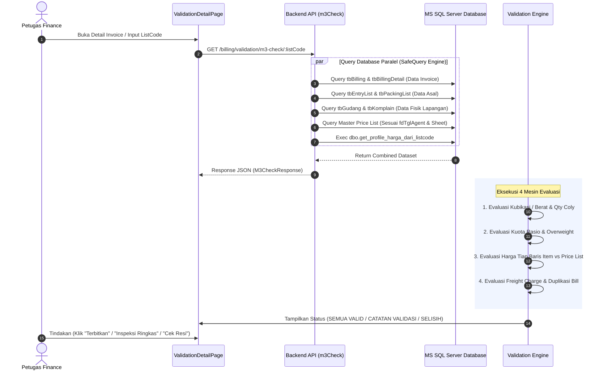

# 📘 Dokumentasi Sistem Validasi Billing (mshipping ERP)

Dokumen ini berisi panduan teknis, alur eksekusi, spesifikasi verifikasi, dan hirarki aturan pada **Sistem Validasi Billing (mshipping)**.

---

## 📑 Daftar Isi
1. [Ringkasan Eksekutif](#1-ringkasan-eksekutif)
2. [Arsitektur & Alur Kerja (End-to-End Pipeline)](#2-arsitektur--alur-kerja-end-to-end-pipeline)
3. [Spesifikasi 4 Pilar Validasi](#3-spesifikasi-4-pilar-validasi)
   - [Pilar 1: Validasi Fisik (Dimensi, Berat & Qty Coly)](#pilar-1-validasi-fisik-dimensi-berat--qty-coly)
   - [Pilar 2: Validasi Overweight & Rasio Berat](#pilar-2-validasi-overweight--rasio-berat)
   - [Pilar 3: Multi-Tier Price List Engine](#pilar-3-multi-tier-price-list-engine)
   - [Pilar 4: Validasi Freight Charge & Duplikasi Transport](#pilar-4-validasi-freight-charge--duplikasi-transport)
4. [Hirarki Evaluasi & Fallback Matrix](#4-hirarki-evaluasi--fallback-matrix)
   - [A. Hirarki Kubikasi M3 (Jalur Laut)](#a-hirarki-kubikasi-m3-jalur-laut)
   - [B. Hirarki Berat KG (Jalur Udara)](#b-hirarki-berat-kg-jalur-udara)
   - [C. Hirarki Penentuan Tarif Master](#c-hirarki-penentuan-tarif-master)
   - [D. Hirarki Vonis Akhir (Status Verdict)](#d-hirarki-vonis-akhir-status-verdict)
5. [Antarmuka Pengguna (UI/UX Design Standard)](#5-antarmuka-pengguna-uiux-design-standard)

---

## 1. Ringkasan Eksekutif

Sistem Validasi Billing adalah mesin audit otomatis (*cross-verification engine*) yang bertugas memverifikasi kesesuaian antara:
1. **Data Finansial (Invoice)**: Rincian item tagihan, kuantiti, satuan ($M^3$/KG/PCS), mata uang, dan tarif per unit.
2. **Data Operasional Logistik**: Data EntryList, Packing List, Timbangan Fisik Gudang, Surat Jalan, dan Ukuran Komplain.
3. **Regulasi Master Tarif**: Price List Khusus Customer, Master Price List MKT/CS (berdasarkan `fdTglAgent`), dan Profil Database Customer (`dbo.get_profile_harga_dari_listcode`).

**Tujuan Utama:**
- **Zero Revenue Leakage**: Mencegah kebocoran pendapatan akibat *undercharge* harga item atau muatan *overweight* yang lolos tanpa tertagih.
- **Eliminasi Sengketa Tagihan**: Memastikan invoice 100% akurat sebelum berstatus `ISSUED`.
- **Efisiensi Kerja Finance**: Validasi puluhan parameter fisik dan tarif berjalan secara instan dalam 1 tampilan layar (*single viewport*).

---

## 2. Arsitektur & Alur Kerja (End-to-End Pipeline)



---

## 3. Spesifikasi 4 Pilar Validasi

### Pilar 1: Validasi Fisik (Dimensi, Berat & Qty Coly)

| Parameter | Jalur Laut (BY SEA) | Jalur Udara (BY AIR) |
|---|---|---|
| **Unit Pengukuran** | Kubikasi ($M^3$) desimal 4 digit | Berat (KG) desimal 2 digit |
| **Sumber Validasi** | 1. Packing List (`tbPackingList`)<br/>2. Timbangan Gudang (`tbGudang`)<br/>3. List Batch (`tbEntryList`)<br/>4. Ukuran Komplain (`tbKomplain`) | 1. Berat EntryList Real<br/>2. Timbangan Gudang<br/>3. Berat Komplain<br/>4. Surat Jalan (`tbSuratJalan`) |
| **Batas Minimum** | Aturan Min. $0.1000\text{ m}^3$ (Real $< 0.1\text{ m}^3 \rightarrow 0.1\text{ m}^3$) | Aturan Min. Charge (Default $3.00\text{ kg}$ atau profil) |
| **Aturan Komplain** | **Strict Qty Matching**: Ukuran komplain disetujui HANYA jika $\text{Qty Komplain} == \text{Qty EntryList}$. Jika beda koli $\rightarrow$ komplain DITOLAK. | Sama (wajib kesesuaian koli). |
| **Deteksi Qty Coly** | Memvalidasi keseragaman jumlah koli antar dokumen asal, gudang, dan packing list. | Memvalidasi keseragaman koli paket udara. |

---

### Pilar 2: Validasi Overweight & Rasio Berat

Khusus pengiriman Jalur Laut (BY SEA) untuk mencegah kerugian akibat muatan padat:

$$\text{Batas Kuota Berat (kg)} = M^3 \times \text{Rasio Customer (kg/m}^3\text{)}$$
$$\text{Hitungan Overweight (kg)} = \max(0, \lceil \text{Berat Fisik Aktual} - \text{Batas Kuota Berat} \rceil)$$

- **Matriks Evaluasi Overweight**:
  1. **Aman (Normal)**: Berat aktual $\le$ batas kuota $\rightarrow$ Status: `BERAT NORMAL (AMAN)`.
  2. **Overweight Tervalidasi**: Berat aktual $>$ kuota dan invoice menagihkan item KG persis sama $\rightarrow$ Status: `OVERWEIGHT TERVALIDASI (+X KG)`.
  3. **Toleransi Pembulatan**: Terdapat selisih $\le 1\text{ kg}$ antara tagihan KG dan perhitungan $\text{Math.ceil}$ $\rightarrow$ Status: `DITAGIHKAN X KG (HITUNGAN +Y KG)`.
  4. **Unneeded Overweight**: Tagihan memuat item KG padahal berat aktual berada di dalam kuota rasio $\rightarrow$ Status: `DITAGIHKAN X KG (TIDAK OVERWEIGHT)`.
  5. **Overweight Belum Ditagih**: Terjadi kelebihan berat fisik tetapi invoice belum memuat tagihan KG $\rightarrow$ Status: `OVERWEIGHT (+X KG) [KRITIS]`.

---

### Pilar 3: Multi-Tier Price List Engine

Mengevaluasi kesesuaian tarif per unit pada setiap baris item invoice terhadap acuan harga master berdasarkan tanggal agen (`fdTglAgent`).

- **Pencocokan Cerdas Komoditas (*Smart Classifier*)**:
  - **Baterai Murni**: Mengidentifikasi `BATTERY`, `POWERBANK`, `ACCU`, `LITHIUM` murni $\rightarrow$ *Semi Garment / Khusus Baterai* (mengecualikan aksesoris charger/casing).
  - **Elektronik Spesifik**: Mengklasifikasikan laptop *Apple* vs *Non-Apple*, serta *iPad / Tablet*.
  - **Lartas Super (LS)**: Mengklasifikasikan *Kosmetik*, *Obat*, *Alkes*, dan *Makanan*.
  - **Tekstil / Garment**: Mengklasifikasikan *Fabric*, *Tekstil*, *Garment*, dan *Semi Garment*.
  - **Umum**: *General Goods / Umum*.
- **Status Baris Item**:
  - `MATCH`: Harga invoice sesuai dengan acuan master.
  - `HIGHER`: Harga invoice di atas tarif acuan (Overcharge yang diizinkan/khusus).
  - `LOWER`: **UNDERCHARGE KRITIS** — Harga invoice di bawah acuan resmi (wajib perbaikan).
  - `NO_TARGET`: Item penyesuaian khusus / auxiliary tanpa acuan master.

---

### Pilar 4: Validasi Freight Charge & Duplikasi Transport

- **Freight Charge (FC Valas)**:
  - Memeriksa apakah `tbEntryList` memuat nilai `fdFC` dan `fdCurrFC` (misal: HK$, USD, RMB, S$).
  - Memastikan seluruh biaya FC operasional telah dimasukkan ke dalam invoice penagihan.
- **Bill Transport & Ekspedisi Lokal (`tbExpIndo`)**:
  - Melakukan cross-check nominal invoice terhadap database ekspedisi lokal.
  - Memeriksa adanya riwayat tagihan ganda (*duplicate bill warning*) dengan nominal dan customer yang sama untuk mencegah *double-invoicing*.

---

## 4. Hirarki Evaluasi & Fallback Matrix

### A. Hirarki Kubikasi M3 (Jalur Laut)

```text
1. Ukuran Komplain Sah (Syarat: Qty Komplain == Qty EntryList)
   └── 2. Ukuran Fisik Gudang (tbGudang)
        └── 3. Ukuran Packing List (tbPackingList)
             └── 4. Ukuran List Batch Asal (tbEntryList)
                  └── 5. Ukuran Parsial Per Marking (Bill Gabungan)
                       └── 6. Fallback Minimum Charge (0.1000 m³)
```

### B. Hirarki Berat KG (Jalur Udara)

```text
1. Berat Komplain Fisik
   └── 2. Berat Surat Jalan (tbSuratJalan)
        └── 3. Berat Real EntryList
             └── 4. Fallback Minimum Charge (Profile / Default 3.00 kg)
```

### C. Hirarki Penentuan Tarif Master

```text
1. Price List Khusus Customer (Customer Price List - Cust Code Match)
   └── 2. Override Marking Khusus
        └── 3. Master Price List (Sesuai fdTglAgent)
             ├── Customer Sales / Broker  ──> Sheet MKT
             └── Customer Direct / CS     ──> Sheet CS
                  └── 4. Profil Database (dbo.get_profile_harga_dari_listcode)
                       └── 5. Smart Commodity Classifier Fallback
```

### D. Hirarki Vonis Akhir (Status Verdict)

| Level | Status Badge | Kondisi Pemicu | Aksi Sistem |
|---|---|---|---|
| **LEVEL 1** | 🔴 **SELISIH (DANGER)** | - Selisih $M^3$ / Berat fisik.<br/>- Harga item di bawah acuan (*Undercharge*).<br/>- Overweight tidak ditagihkan.<br/>- Komplain ditolak tapi dipakai invoice. | Tombol Terbitkan terkunci / Peringatan keras. |
| **LEVEL 2** | 🟡 **CATATAN (WARNING)** | - Toleransi pembulatan overweight ($\le 1\text{ kg}$).<br/>- Unneeded overweight ditagihkan.<br/>- Perbedaan jumlah koli (Qty Alert).<br/>- Potensi duplikasi tagihan transport. | Dapat diterbitkan dengan konfirmasi catatan. |
| **LEVEL 3** | 🟢 **SEMUA VALID (SUCCESS)** | - Seluruh dimensi, berat, rasio, harga item, dan FC cocok 100%. | Siap diterbitkan langsung (*Issued Ready*). |

---

## 5. Antarmuka Pengguna (UI/UX Design Standard)

1. **Desktop (PC/Laptop $\ge$ 1024px) — Single Viewport 1 Layar**:
   - Kontainer `h-[calc(100vh-4.25rem)]` dan `overflow-hidden` (tanpa scroll window browser).
   - **Kolom Kiri (5/12)**: Identitas Customer (Compact) + Tabel Item Tagihan (Internal Scroll) + Sticky Footer Grand Total.
   - **Kolom Kanan (7/12)**: Mesin Validasi 3 Tab Terpadu:
     - **Tab 1**: *Validasi M3 & Berat* (Metrik Kubikasi/Berat + Panel Overweight & Rasio).
     - **Tab 2**: *Tarif & Price List* (Bar Sumber Tarif + Tabel Validasi Baris Item + Profil DB).
     - **Tab 3**: *Freight Charge* (Ringkasan FC EntryList).
2. **Mobile / Tablet (< 1024px) — Vertical Adaptive Stack**:
   - Kontainer `min-h-screen` dengan scroll halaman alami vertikal.
   - Tabel tagihan `max-h-[350px]` agar pengguna tetap dapat melihat kartu validasi operasional di bawahnya.
   - Top Header Bar otomatis membungkus (*wrap*) tombol aksi secara rapi.
3. **Modal Ringkasan (Inspeksi Ringkas)**:
   - Menampilkan *Instant Verdict Banner*, ringkasan fisik vs operasional, perbandingan overweight, dan daftar baris item di bawah tarif acuan.

---
*Dokumen ini diperbarui secara otomatis sesuai implementasi kode produksi mshipping ERP.*
