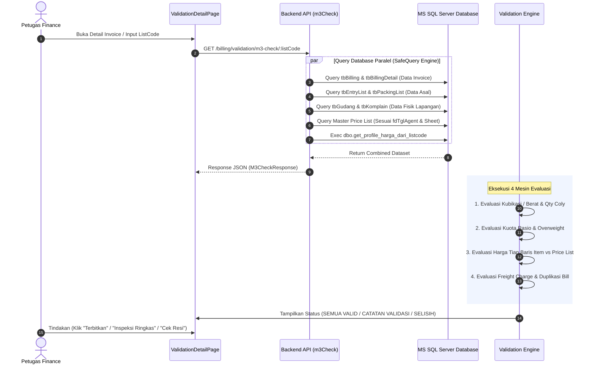

# 📘 Dokumentasi Sistem Validasi Billing (mshipping ERP)

Dokumen ini berisi panduan teknis, alur eksekusi, spesifikasi verifikasi, dan hirarki aturan pada **Sistem Validasi Billing (mshipping)**.

---

## 📑 Daftar Isi
1. [Ringkasan Eksekutif](#1-ringkasan-eksekutif)
2. [Arsitektur & Alur Kerja (End-to-End Pipeline)](#2-arsitektur--alur-kerja-end-to-end-pipeline)
3. [Spesifikasi 4 Pilar Validasi](#3-spesifikasi-4-pilar-validasi)
   - [Pilar 1: Validasi Fisik (Dimensi, Berat & Qty Coly)](#pilar-1-validasi-fisik-dimensi-berat--qty-coly)
   - [Pilar 2: Validasi Overweight & Rasio Berat](#pilar-2-validasi-overweight--rasio-berat)
   - [Pilar 3: Multi-Tier Price List Engine](#pilar-3-multi-tier-price-list-engine)
   - [Pilar 4: Validasi Freight Charge & Duplikasi Transport](#pilar-4-validasi-freight-charge--duplikasi-transport)
4. [Hirarki Evaluasi & Fallback Matrix](#4-hirarki-evaluasi--fallback-matrix)
   - [A. Hirarki Kubikasi M3 (Jalur Laut)](#a-hirarki-kubikasi-m3-jalur-laut)
   - [B. Hirarki Berat KG (Jalur Udara)](#b-hirarki-berat-kg-jalur-udara)
   - [C. Hirarki Penentuan Tarif Master](#c-hirarki-penentuan-tarif-master)
   - [D. Hirarki Vonis Akhir (Status Verdict)](#d-hirarki-vonis-akhir-status-verdict)
5. [Antarmuka Pengguna (UI/UX Design Standard)](#5-antarmuka-pengguna-uiux-design-standard)

---

## 1. Ringkasan Eksekutif

Sistem Validasi Billing adalah mesin audit otomatis (*cross-verification engine*) yang bertugas memverifikasi kesesuaian antara:
1. **Data Finansial (Invoice)**: Rincian item tagihan, kuantiti, satuan ($M^3$/KG/PCS), mata uang, dan tarif per unit.
2. **Data Operasional Logistik**: Data EntryList, Packing List, Timbangan Fisik Gudang, Surat Jalan, dan Ukuran Komplain.
3. **Regulasi Master Tarif**: Price List Khusus Customer, Master Price List MKT/CS (berdasarkan `fdTglAgent`), dan Profil Database Customer (`dbo.get_profile_harga_dari_listcode`).

**Tujuan Utama:**
- **Zero Revenue Leakage**: Mencegah kebocoran pendapatan akibat *undercharge* harga item atau muatan *overweight* yang lolos tanpa tertagih.
- **Eliminasi Sengketa Tagihan**: Memastikan invoice 100% akurat sebelum berstatus `ISSUED`.
- **Efisiensi Kerja Finance**: Validasi puluhan parameter fisik dan tarif berjalan secara instan dalam 1 tampilan layar (*single viewport*).

---

## 2. Arsitektur & Alur Kerja (End-to-End Pipeline)



---

## 3. Spesifikasi 4 Pilar Validasi

### Pilar 1: Validasi Fisik (Dimensi, Berat & Qty Coly)

| Parameter | Jalur Laut (BY SEA) | Jalur Udara (BY AIR) |
|---|---|---|
| **Unit Pengukuran** | Kubikasi ($M^3$) desimal 4 digit | Berat (KG) desimal 2 digit |
| **Sumber Validasi** | 1. Packing List (`tbPackingList`)<br/>2. Timbangan Gudang (`tbGudang`)<br/>3. List Batch (`tbEntryList`)<br/>4. Ukuran Komplain (`tbKomplain`) | 1. Berat EntryList Real<br/>2. Timbangan Gudang<br/>3. Berat Komplain<br/>4. Surat Jalan (`tbSuratJalan`) |
| **Batas Minimum** | Aturan Min. $0.1000\text{ m}^3$ (Real $< 0.1\text{ m}^3 \rightarrow 0.1\text{ m}^3$) | Aturan Min. Charge (Default $3.00\text{ kg}$ atau profil) |
| **Aturan Komplain** | **Strict Qty Matching**: Ukuran komplain disetujui HANYA jika $\text{Qty Komplain} == \text{Qty EntryList}$. Jika beda koli $\rightarrow$ komplain DITOLAK. | Sama (wajib kesesuaian koli). |
| **Deteksi Qty Coly** | Memvalidasi keseragaman jumlah koli antar dokumen asal, gudang, dan packing list. | Memvalidasi keseragaman koli paket udara. |

---

### Pilar 2: Validasi Overweight & Rasio Berat

Khusus pengiriman Jalur Laut (BY SEA) untuk mencegah kerugian akibat muatan padat:

$$\text{Batas Kuota Berat (kg)} = M^3 \times \text{Rasio Customer (kg/m}^3\text{)}$$
$$\text{Hitungan Overweight (kg)} = \max(0, \lceil \text{Berat Fisik Aktual} - \text{Batas Kuota Berat} \rceil)$$

- **Matriks Evaluasi Overweight**:
  1. **Aman (Normal)**: Berat aktual $\le$ batas kuota $\rightarrow$ Status: `BERAT NORMAL (AMAN)`.
  2. **Overweight Tervalidasi**: Berat aktual $>$ kuota dan invoice menagihkan item KG persis sama $\rightarrow$ Status: `OVERWEIGHT TERVALIDASI (+X KG)`.
  3. **Toleransi Pembulatan**: Terdapat selisih $\le 1\text{ kg}$ antara tagihan KG dan perhitungan $\text{Math.ceil}$ $\rightarrow$ Status: `DITAGIHKAN X KG (HITUNGAN +Y KG)`.
  4. **Unneeded Overweight**: Tagihan memuat item KG padahal berat aktual berada di dalam kuota rasio $\rightarrow$ Status: `DITAGIHKAN X KG (TIDAK OVERWEIGHT)`.
  5. **Overweight Belum Ditagih**: Terjadi kelebihan berat fisik tetapi invoice belum memuat tagihan KG $\rightarrow$ Status: `OVERWEIGHT (+X KG) [KRITIS]`.

---

### Pilar 3: Multi-Tier Price List Engine

Mengevaluasi kesesuaian nilai tarif per unit pada setiap baris item invoice penagihan terhadap acuan resmi master tarif. Mesin ini beroperasi secara deterministik menggunakan tanggal agen (`fdTglAgent`), kode kontainer/marking (`fdMarkingCode`), moda pengiriman (`BY SEA` vs `BY AIR`), cabang asal (`GZ`, `YW`, `SH`, `SZ`, `HK`, `SG`, `BKK`), serta profil segmentasi customer.

#### 1. Arsitektur Hirarki Resolusi Tarif (Waterfall 6-Tier)

Sistem mencari tarif acuan menggunakan algoritma evaluasi bertingkat (*waterfall evaluation*) dari tingkat paling spesifik hingga acuan global secara deterministik:

| Level | Kode Sumber (`priceSource`) | Deskripsi & Aturan Seleksi | Prioritas |
|---|---|---|:---:|
| **Tier 1** | `CUSTOMER_COMMODITY` | **Harga Customer Commodity**:<br/>Tarif khusus komoditas spesifik milik customer (`fdCustCode`), baik dari entri manual komoditi khusus (`upload.fileName === 'MANUAL_ENTRY'`) maupun pemetaan alias komoditas customer aktif (`tbCommodityMapping` dengan `fdCustCode = custCode`). | Tertinggi (P1) |
| **Tier 2** | `CUSTOMER_MARKING` | **Harga Customer Marking (Marking Override)**:<br/>File price list khusus customer (`fdCustCode`) yang memiliki klausul *Marking Override* (`tbCustomerPriceListUploadMarking`). Berlaku jika kode kontainer pengiriman memenuhi syarat $\text{Marking Invoice} \ge \text{Marking Syarat}$ dan tanggal efektif $\le \text{Tanggal Agen}$. | P2 |
| **Tier 3** | `CUSTOMER_DEFAULT` | **Harga Customer Default**:<br/>File price list khusus customer standar aktif (tanpa override atau override tidak terpenuhi) dengan $\text{effectiveDate} \le \text{Tanggal Agen}$. | P3 |
| **Tier 4** | `GLOBAL_COMMODITY` | **Harga Commodity Global**:<br/>Acuan tarif komoditas khusus global pada Master Price List yang dipetakan melalui `tbCommodityMapping` global (`fdCustCode IS NULL`) atau kategori khusus sistem (Battery $\rightarrow$ Semi Garment laut, Tablet/iPad, Laptop Apple vs non-Apple). | P4 |
| **Tier 5** | `GLOBAL_MARKING` | **Harga Marking Global (Master Marking Override)**:<br/>File Master Price List global yang memiliki klausul *Marking Override* aktif pada kontainer bersangkutan ($\text{Marking Invoice} \ge \text{Marking Syarat}$). Menggunakan Sheet MKT jika broker/sales MKT, Sheet CS jika direct. | P5 |
| **Tier 6** | `MASTER_MKT`<br/>`MASTER_CS` | **Master Price List Umum Standar**:<br/>Acuan tarif master aktif per periode tanggal agen ($\text{effectiveDate} \le \text{Tanggal Agen}$):<br/>- **Sheet MKT**: Customer dengan `fdBroker == 1` ATAU dipegang oleh sales grup MKT (`ERIC`, `EDDIE HTM`, `FEBRI A`, `HERY`, `INDAH`, `SUSI`, `TSC`, `KB`) ATAU memuat kata `BROKER`.<br/>- **Sheet CS**: Customer direct / reguler tanpa relasi broker/marketing khusus. | P6 |
| **Fallback**| `NO_RATE` | **Belum Ada Acuan Tarif Resmi**:<br/>Jika seluruh 6 tier tidak menemukan acuan, sistem menetapkan status `NO_RATE`. Seluruh fallback database lama (`vwCustomersHargaUnpivot`, `tbCustomersHargaAudit`) dan SP ERP (`dbo.get_profile_harga_dari_listcode`) **dieliminasi dari pencarian tarif komoditas**. | Akhir |

#### 2. Logika Komparasi Marking Kontainer (`isMarkingGreaterOrEqual`)

Untuk menentukan keabsahan *Marking Override* (misal: tarif baru berlaku mulai kontainer `26GZD07` ke atas):
1. **Validasi Kesamaan Rute & Moda**: Memastikan kode cabang (`fdBranchCode`) dan tipe moda (`fdListType`: Udara = 1, Laut = 2) identik antara shipment dan acuan override.
2. **Komparasi Tanggal Muat Kontainer (`fdLoadDate`)**:
   $$\text{Shipment Valid} \iff \text{fdLoadDate}(\text{Shipment}) \ge \text{fdLoadDate}(\text{Override Target})$$
3. **Fallback Perbandingan Alfanumerik**: Jika salah satu tanggal muat belum terbit di `tbMarking`, sistem membandingkan nilai string 4-karakter prefix (misal: `26GZD07` $\ge$ `26GZC91`). Jika prefix cabang/tahun berbeda (misal `26SG` vs `26GZ`), override otomatis DITOLAK.

#### 3. Pencocokan Cerdas Komoditas (*Smart Commodity Classifier*)

Menjembatani variasi penamaan komoditas pada invoice, packing list, dan master tarif:

- **A. Pengelompokan Sinonim Resmi (`COMMODITY_SYNONYM_GROUPS`)**:
  - `UMUM`: *GENERAL GOODS*, *GENERAL*, *NON-BRAND*, *NON BATTERY*.
  - `TEKSTIL`: *FABRIC*, *TEXTILE*, *GARMENTS*.
  - `LARTAS - N`: *LARTAS NORMAL*, *BRANDED GOODS, LARTAS NORMAL*.
  - `LARTAS - S`: *LARTAS SUPER*, *BRANDED*, *KOSMETIK*, *OBAT*, *SUPPLEMENT*, *ALKES*.
  - `SEMI GARMENT`: *SEMI-GARMENT*, *BATTERY*, *POWERBANK (MSDS REQUIRED)*.
  - `GARMENT`: *GARMENT*, *FULL BOX PACKING*.
  - `GADGET & ELEKTRONIK`: *LAPTOP*, *NOTEBOOK*, *MACBOOK*, *IPAD*, *TABLET*.
  - `KOMODITAS KHUSUS`: *HANDPHONE*, *FCL*, *LEGAL*, *MASKER*, *SEPEDA MAHAL*, *PESTISIDA*.

- **B. Aturan Transformasi Komoditas Bisnis (Strict Override Rules)**:
  - **Baterai Murni (`isGenuineBattery`)**:
    - *Deteksi Positif*: Regex `\b(BATTERY|BATTERIES|BATERAI|POWERBANK|ACCU|AKI)\b`.
    - *Filter Aksesoris (Negasi)*: Jika teks memuat `CHARGER`, `CASING`, `HOLDER`, `TESTER`, `COVER`, `CABLE`, `WIRE`, `CONNECTOR` $\rightarrow$ barang diakui sebagai aksesoris umum/normal.
    - *Aturan Laut*: Barang baterai murni otomatis dialihkan (*override*) ke tarif **`SEMI GARMENT`**.
  - **iPad & Tablet (`isGenuineIpad`)**:
    - Memisahkan unit fisik iPad/Tablet dari aksesoris (*casing, tempered glass, stylus pen*).
    - Jalur Laut $\rightarrow$ dialihkan ke **`KHUSUS IPAD (PRICE PER PCS, MIN. CHARGE 3 PCS)`**.
    - Jalur Udara $\rightarrow$ dialihkan ke **`TABLET (PRICE PER KG, MIN 3PCS)`**.
  - **Laptop & MacBook (`isGenuineLaptop`)**:
    - Jalur Laut $\rightarrow$ **`LAPTOP (PRICE PER PCS, MIN. CHARGE 3 PCS)`**.
    - Jalur Udara Non-Apple $\rightarrow$ **`LAPTOP (SELAIN MEREK APPLE PRICE PER KG, MIN. 3PCS)`**.
    - Jalur Udara Apple (`isAppleDevice`) $\rightarrow$ **`APPLE LAPTOP (PER KG)`**.
  - **Pemetaan Dinamis Database (`tbCommodityMapping`)**:
    - Prioritas pemetaan manual spesifik per customer (`fdCustCode`) atau global jika terdapat perjanjian nama dagang unik.

- **C. Token & Substring Heuristic Scorer**:
  Pencocokan terhadap daftar komoditas batch (`tbMarking` commodities):
  $$\text{Score} = (3 \times \text{Exact Token}) + (2 \times \text{Full Substring}) + (1 \times \text{Partial Token})$$
  Kandidat dengan skor tertinggi dan tingkat lartas lebih spesifik (*Lartas Super*) diprioritaskan.

#### 4. Validasi Baris Item Khusus & Non-Komoditas

Setiap baris invoice diperiksa tipenya untuk mencegah salah acuan:

- **Item Overweight Laut (`KG`)**:
  - Dideteksi dari satuan `KG` atau teks `PARCELS TO JAKARTA (KG)`.
  - Target acuan: **`Tarif KG Agen`** dari profil database customer (`res.profileHarga.kg`).
- **Item Tax Return**:
  - Dideteksi dari teks `TAX RETURN` / `TAXRETURN`.
  - Target acuan: `res.profileHarga.taxReturnPrice` dengan validasi batas minimum kubikasi `taxReturnMinCharge` $\text{m}^3$.
- **Item Freight Charge (Valas FC)**:
  - Dideteksi dari teks `FREIGHT CHARGE` atau satuan valas (`HK$`, `USD`, `RMB`, `S$`).
  - Target kuantiti: Cross-check langsung ke nilai operasional `tbEntrylist.fdFC`. Jika `fdFC` ada di batch tetapi tidak tertagih $\rightarrow$ Peringatan Kritis.
- **Item Air Volume Freight Charge (VFC)**:
  - Dideteksi dari teks `VOLUME FREIGHT` / `VFC` jalur udara.
  - Target kuantiti: Cross-check ke berat kubikasi timbangan gudang `res.vfcGudangPerMarking` / `res.fdVFCGudang`.
- **Biaya Ekspedisi / Transport Lokal**:
  - Teks memuat `TRANSPORT`, `DELIVERY`, `ONGKIR`, `TRUCKING` $\rightarrow$ Ditetapkan status `NO_TARGET` (dikecualikan dari master tarif barang dan dialihkan ke pengecekan ekspedisi lokal Pilar 4).

#### 5. Matriks Evaluasi Status Baris Item

Perbandingan harga aktual invoice ($P_{\text{inv}}$) terhadap acuan master minimum ($P_{\text{min}}$) dan maksimum ($P_{\text{max}}$) dengan toleransi selisih floating point $\pm \text{Rp } 1$:

| Status Item | Indikator UI | Kondisi Matematis | Klasifikasi Resiko & Perilaku Sistem |
|---|---|---|---|
| **`MATCH`** | 🟢 **Cocok** | $P_{\text{min}} - 1 \le P_{\text{inv}} \le P_{\text{max}} + 1$ | **Aman**: Harga sesuai regulasi resmi. Tombol terbitkan langsung memproses penerbitan invoice. |
| **`HIGHER`** | 🟡 **Di Atas Acuan** | $P_{\text{inv}} > P_{\text{max}} + 1$ | **Info/Warning (Overcharge)**: Tombol Terbitkan **TETAP AKTIF (ENABLED)** dengan badge info overcharge (markup disepakati). |
| **`LOWER`** | 🔴 **Di Bawah Acuan** | $P_{\text{inv}} < P_{\text{min}} - 1$ | **UNDERCHARGE (Peringatan Kritis)**: Tombol Terbitkan **TETAP AKTIF (ENABLED)**, namun sistem memunculkan **Modal Konfirmasi Peringatan Keras** yang merinci selisih kerugian dan meminta konfirmasi eksplisit user sebelum diterbitkan. |
| **`NOT_SET`** | ⚪ **Belum Diisi** | $P_{\text{inv}} == 0 \land P_{\text{master}} > 0$ | **Peringatan**: Item terdaftar tetapi harga penagihan masih Rp 0. |
| **`NO_RATE`** | ⚪ **Belum Ada Tarif** | $P_{\text{master}} == 0$ | **Perhatian**: Belum ada konfigurasi tarif di 6-tier price list. |
| **`NO_TARGET`** | ⚪ **Auxiliary / Non-Rate** | Item Transport / Penyesuaian Bebas | **Netral**: Komponen biaya operasional tanpa pembanding master barang. |

---

### Pilar 4: Validasi Freight Charge & Duplikasi Transport

- **Freight Charge (FC Valas)**:
  - Memeriksa apakah `tbEntryList` memuat nilai `fdFC` dan `fdCurrFC` (misal: HK$, USD, RMB, S$).
  - Memastikan seluruh biaya FC operasional telah dimasukkan ke dalam invoice penagihan.
- **Bill Transport & Ekspedisi Lokal (`tbExpIndo`)**:
  - Melakukan cross-check nominal invoice terhadap database ekspedisi lokal.
  - Memeriksa adanya riwayat tagihan ganda (*duplicate bill warning*) dengan nominal dan customer yang sama untuk mencegah *double-invoicing*.

---

## 4. Hirarki Evaluasi & Fallback Matrix

### A. Hirarki Kubikasi M3 (Jalur Laut)

```text
1. Ukuran Komplain Sah (Syarat: Qty Komplain == Qty EntryList)
   └── 2. Ukuran Fisik Gudang (tbGudang)
        └── 3. Ukuran Packing List (tbPackingList)
             └── 4. Ukuran List Batch Asal (tbEntryList)
                  └── 5. Ukuran Parsial Per Marking (Bill Gabungan)
                       └── 6. Fallback Minimum Charge (0.1000 m³)
```

### B. Hirarki Berat KG (Jalur Udara)

```text
1. Berat Komplain Fisik
   └── 2. Berat Surat Jalan (tbSuratJalan)
        └── 3. Berat Real EntryList
             └── 4. Fallback Minimum Charge (Profile / Default 3.00 kg)
```

### C. Hirarki Penentuan Tarif Master

```text
1. Tier 1: Harga Customer Commodity (CUSTOMER_COMMODITY - Manual Entry / Alias Mapping Customer)
   └── 2. Tier 2: Harga Customer Marking (CUSTOMER_MARKING - Syarat: Marking >= Override)
        └── 3. Tier 3: Harga Customer Default (CUSTOMER_DEFAULT - effectiveDate <= fdTglAgent)
             └── 4. Tier 4: Harga Commodity Global (GLOBAL_COMMODITY - Global Mapping / Master Commodity)
                  └── 5. Tier 5: Harga Marking Global (GLOBAL_MARKING - Syarat: Marking >= Override)
                       ├── Broker / Sales MKT Group       ──> Sheet MKT
                       └── Customer Direct / Non-Broker   ──> Sheet CS
                            └── 6. Tier 6: Master MKT / CS Standar Global (effectiveDate <= fdTglAgent)
                                 ├── Broker / Sales MKT Group       ──> Sheet MKT
                                 └── Customer Direct / Non-Broker   ──> Sheet CS
                                      └── 7. Fallback: NO_RATE (Belum Ada Acuan Tarif Resmi)
```

### D. Hirarki Vonis Akhir (Status Verdict)

| Level | Status Badge | Kondisi Pemicu | Aksi Sistem |
|---|---|---|---|
| **LEVEL 1** | 🔴 **SELISIH (DANGER)** | - Selisih $M^3$ / Berat fisik.<br/>- Harga item di bawah acuan (*Undercharge*).<br/>- Overweight tidak ditagihkan.<br/>- Komplain ditolak tapi dipakai invoice. | Tombol Terbitkan tetap aktif, memunculkan modal dialog konfirmasi peringatan keras undercharge/selisih fisik sebelum terbit. |
| **LEVEL 2** | 🟡 **CATATAN (WARNING)** | - Toleransi pembulatan overweight ($\le 1\text{ kg}$).<br/>- Unneeded overweight ditagihkan.<br/>- Harga di atas acuan (*Overcharge*).<br/>- Perbedaan jumlah koli (Qty Alert).<br/>- Potensi duplikasi tagihan transport. | Tombol Terbitkan tetap aktif, dapat diterbitkan dengan catatan peringatan. |
| **LEVEL 3** | 🟢 **SEMUA VALID (SUCCESS)** | - Seluruh dimensi, berat, rasio, harga item, dan FC cocok 100%. | Siap diterbitkan langsung (*Issued Ready*). |

---

## 5. Antarmuka Pengguna (UI/UX Design Standard)

1. **Desktop (PC/Laptop $\ge$ 1024px) — Single Viewport 1 Layar**:
   - Kontainer `h-[calc(100vh-4.25rem)]` dan `overflow-hidden` (tanpa scroll window browser).
   - **Kolom Kiri (5/12)**: Identitas Customer (Compact) + Tabel Item Tagihan (Internal Scroll) + Sticky Footer Grand Total.
   - **Kolom Kanan (7/12)**: Mesin Validasi 3 Tab Terpadu:
     - **Tab 1**: *Validasi M3 & Berat* (Metrik Kubikasi/Berat + Panel Overweight & Rasio).
     - **Tab 2**: *Tarif & Price List* (Bar Sumber Tarif + Tabel Validasi Baris Item + Profil DB).
     - **Tab 3**: *Freight Charge* (Ringkasan FC EntryList).
2. **Mobile / Tablet (< 1024px) — Vertical Adaptive Stack**:
   - Kontainer `min-h-screen` dengan scroll halaman alami vertikal.
   - Tabel tagihan `max-h-[350px]` agar pengguna tetap dapat melihat kartu validasi operasional di bawahnya.
   - Top Header Bar otomatis membungkus (*wrap*) tombol aksi secara rapi.
3. **Modal Ringkasan (Inspeksi Ringkas)**:
   - Menampilkan *Instant Verdict Banner*, ringkasan fisik vs operasional, perbandingan overweight, dan daftar baris item di bawah tarif acuan.

---
*Dokumen ini diperbarui secara otomatis sesuai implementasi kode produksi mshipping ERP.*
